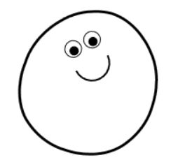

# Blob Sallad .NET
I found this little blob engine code, and converted it run in WPF under C#.
The GUI drawing code is verified with [ApprovalTests.Net](https://github.com/approvals/ApprovalTests.Net).
See the [Android Kotlin](https://github.com/GregEakin/BlobSallad.Android) version.

## From the website: [Blob Sallad](https://blobsallad.se/)


Original version by: [Björn Lindberg](mailto:bjoern.lindberg@gmail.com)

## See his writeup at [Blob Sallad — Canvas Tag and JavaScript Physics Simulation Experiment](https://dev.opera.com/articles/blob-sallad-canvas-tag-and-javascript/)

## Sample code
Here's a test that verifies the [OohFace](BlobSalladTests/BlobTests.DrawOohFaceTest.Microsoft_Windows_10_Pro.approved.png).
It creates a canvas, sets up the translate tranformation, executes the test code, and verifies the results.
If this code produces the same image, as the one approved, the test will pass.
```C#
[Test]
public void DrawOohFaceTest()
{
    var canvas = new Canvas {Width = 100, Height = 100};

    var translateTransform = new TranslateTransform(50.0, 50.0);
    var transformGroup = new TransformGroup();
    transformGroup.Children.Add(translateTransform);

    var blob = new Blob(50.0, 50.0, 25.0, 5);
    blob.DrawOohFace(canvas, 3.0, transformGroup);

    var wpf = new ContentControl {Content = canvas};
    WpfApprovals.Verify(wpf);
}
```

## Links:
- [Community Edition of Visual Studio](https://www.visualstudio.com/vs/community/)
- [Approval Tests](http://approvaltests.com/)
- [Git Extensions](http://gitextensions.github.io/)

## Author
:fire: [Greg Eakin](https://www.linkedin.com/in/gregeakin)
